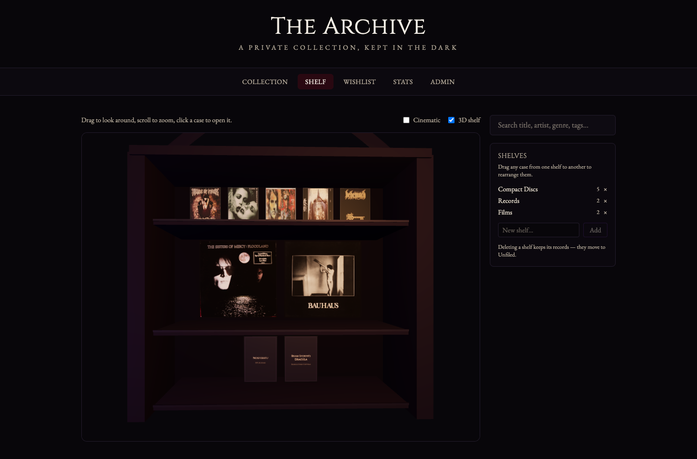

# The Archive

A 3D catalogue for a physical collection of CDs, records and films. Built to be
hosted free on GitHub Pages and installed as a Windows app, with no setup at all
for the person using it.



## What it does

- **A bookcase you arrange yourself.** Named shelves, drag any case between or
  within them, and the arrangement sticks.
- **Each medium behaves like the object it is.** A CD's disc slides out and
  turns, a record drops spinning at 33rpm, and every case flips to its real
  back cover.
- **Artwork and details fill themselves in.** Type an album title, pick the
  pressing that matches the copy in your hand, and the label, year, catalogue
  number, barcode and tracklist arrive with the cover art.
- **Your collection is a real file.** It saves to a file on your own computer
  that you can see, copy and back up.
- Search, filters, wishlist, ratings, condition notes and collection stats.

## Running it

```bash
npm install
npm run dev            # http://localhost:5173
```

| Command | What it does |
|---|---|
| `npm run dev` | Development server |
| `npm run build` | Production build into `dist/` |
| `npm run preview` | Serve the built site at its deployed path |
| `npm test` | Unit tests |
| `npm run lint` | Lint |
| `node scripts/verify.mjs` | Drives a real browser over every page and reports errors |
| `node scripts/enrich-collection.mjs` | Backfills the seed data from MusicBrainz |

## Where the collection is stored

Three tiers, only one of which anyone has to think about:

1. **IndexedDB** — the live working copy. Automatic and invisible.
2. **A file on disk** — one click, once, from the Admin page. Every change
   after that writes to a real `the-archive.json` wherever you chose to put it.
   Survives clearing browser data. Chromium only; elsewhere use Export.
3. **Export / Import** — a JSON backup that works in any browser.

Old exports import cleanly: missing fields take their schema defaults, and a
single unreadable record is skipped rather than failing the whole restore.

## Deploying

Push to `main`. The workflow in `.github/workflows/deploy.yml` type-checks,
lints, tests, builds and publishes to GitHub Pages.

Enable it once under **Settings → Pages → Source → GitHub Actions**.

The base path is derived from the repository name at build time, so renaming
the repo will not break the deployed asset paths.

## Metadata sources

| Source | Setup | Provides |
|---|---|---|
| [MusicBrainz](https://musicbrainz.org) | none | Pressing, label, year, country, barcode, catalogue number, tracklist |
| [Cover Art Archive](https://coverartarchive.org) | none | Front cover, back cover, disc face |
| [TMDB](https://themoviedb.org) | API key | Film posters and synopses — not yet wired up |

MusicBrainz distinguishes individual *pressings*, not just albums, which is the
distinction that matters when you are holding one particular copy.

Two things worth knowing if you touch this code:

- The Cover Art Archive returns `http://` image URLs. They are rewritten to
  `https://` in `src/services/coverArt.ts`; without that they are blocked as
  mixed content on the deployed site.
- MusicBrainz asks for a descriptive `User-Agent`, which a browser will not let
  you set — `fetch` treats it as a forbidden header. Requests instead queue
  through a 1.1 second throttle to stay inside their rate limit.

## Layout

```
src/
  components/       UI, grouped by area
  data/             Schema, IndexedDB, file sync, repository
  scenes/           The 3D bookcase — layout maths, cases, lighting
  services/         MusicBrainz, Cover Art Archive, colour sampling
  store/            Zustand stores
```

The 3D stack is lazy-loaded and kept in its own bundle chunk, so the grid pages
never pay for three.js. Nothing outside `src/scenes/` may import from it.

## Notes

- `PLAN.md` records the architecture decisions and what is still outstanding.
- The palette and typography are defined once, in `src/styles/index.css`.
